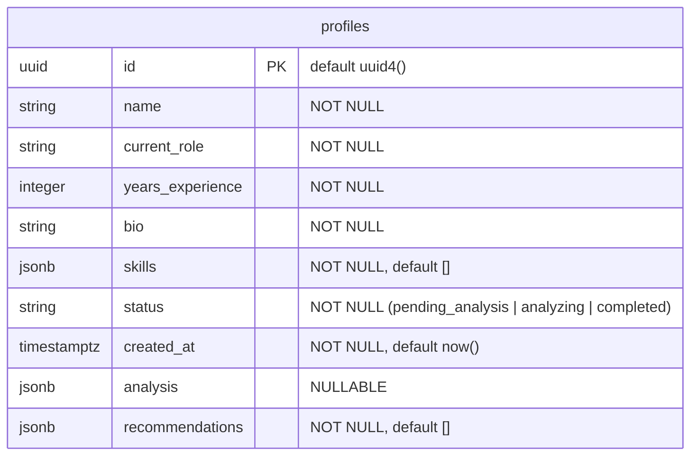

# Architecture Decisions

This document records the meaningful technical decisions taken while building the Sendos Skill Recommender MVP, along with the trade-offs accepted and the planned evolution path.

---

## Decision: In-memory dictionary storage in Phase 1, swapped for PostgreSQL in Phase 3

### Chosen option
Persist profiles in a module-level `dict[str, dict]` keyed by string UUID in `backend/app/routers/profiles.py`. Replace with SQLAlchemy + PostgreSQL in Phase 3 without changing any endpoint signatures or response shapes.

### Justification
The 4-endpoint contract is the hard requirement; storage is an implementation detail behind it. Starting with a dict let Phase 1 focus on the API surface (validation, response shapes, status flow, error handling) without database modeling, pooling, migrations, or local DB setup.

When Phase 3 swaps in PostgreSQL, endpoint signatures don't change — only the read/write lines inside each one. The Pydantic schemas in `backend/app/schemas.py` are already the source of truth; the storage layer just has to produce objects that conform.

### Accepted trade-offs
- All data is lost on every server restart. There is no persistence at all in Phase 1 or 2.
- The store is not thread-safe. With Uvicorn running a single worker on the dev box this is fine; under any concurrency it would race.
- We cannot do meaningful queries (filters, joins, pagination) — `GET /api/profiles` does a full scan.

### Mitigations
- The endpoint signatures and Pydantic schemas were designed up-front to look identical to what a SQLAlchemy-backed version would return. The router in Phase 2 builds a `ProfileCreate` model from the dict before calling the analyzer, deliberately practicing the "convert storage shape to typed object" boundary the DB version will need.
- Profile IDs are UUIDs (strings) rather than auto-incremented integers, so no IDs need to be regenerated when the DB lands.

### Evolution plan
- **Phase 3**: introduce `backend/app/database.py` (engine + session factory) and `backend/app/models.py` (SQLAlchemy models). Replace the dict reads/writes inside each endpoint with a session-scoped query. Add `alembic` for migrations. Profile IDs remain UUIDs.
- **Future**: add `created_at` / `updated_at` audit columns and basic indexes once query patterns are clear.

---

## Decision: Synchronous LLM processing — no Celery, Redis, or background queues

### Chosen option
The `POST /api/profiles/{id}/analyze` endpoint runs the three LLM calls inline and only returns to the client once analysis is complete (or has failed). Status is mutated on the stored profile during execution so that a parallel `GET` request can observe `pending_analysis → analyzing → completed` (or `pending_analysis` again on failure).

### Justification
The project brief excluded queues, workers, and background processing. Beyond compliance, synchronous is the simplest design that meets the requirement: no broker, no consumer process, no state machine to reconcile, no distributed-tracing problem.

For an MVP with one user at a time, a 10-25 second blocking call is acceptable. The status flow also gives a frontend a way to show progress by polling `GET /api/profiles/{id}` during execution.

### Accepted trade-offs
- The HTTP request blocks for the full duration of the LLM pipeline (~10-25 seconds in practice). Browsers, proxies, and load balancers often time out around 30-60 seconds, so this design will not scale to slower model combinations or longer chains.
- Anthropic API errors propagate directly to the client. There is no retry, no exponential backoff, no dead-letter queue.
- The server cannot trivially run multiple analyses concurrently because the dict store is not thread-safe (related to the previous decision).

### Mitigations
- The status flow (`pending_analysis → analyzing → completed`) is implemented even though the call is synchronous. A frontend or a test can observe the in-progress state by polling.
- On any exception during analysis, the router resets the profile status back to `pending_analysis` so the client can retry cleanly without manual cleanup.
- Model selection (Haiku for two of the three steps) keeps the typical total latency in the 10-15 second range rather than 30+.

### Evolution plan
- If we ever need to scale beyond one-at-a-time analyses, the analyzer is already cleanly separated behind `ai_analyzer.analyze_profile()`. A future revision could push the call onto a background task (FastAPI's `BackgroundTasks`, a thread, or eventually an external queue) without touching the analyzer code itself.
- A streaming response would require switching to an async path inside the analyzer (LangChain supports both); for now the synchronous interface is simpler.

---

## Decision: Three-step prompt chain instead of one large prompt

### Chosen option
Profile analysis is split into three sequential LLM calls in `backend/app/services/ai_analyzer.py`:

1. **Extract skills** from the profile.
2. **Detect interests** given the profile + extracted skills.
3. **Generate career paths** given the profile + skills + interests.

Each step has its own focused prompt and its own Pydantic output schema. The output of each step is interpolated into the next step's prompt as plain text (the chain link).

### Justification
A single prompt asking for skills + interests + career paths forces three different cognitive tasks in one shot:
- Mechanical extraction (skills)
- Inference (interests)
- Strategic synthesis (career paths)

These have different reasoning patterns and benefit from different schemas. Splitting produces tighter prompts, smaller per-call schemas (less drift room), and isolates failures when a result looks off. Each step's output stays independently inspectable, which mattered during development and would again for evaluation work.

### Accepted trade-offs
- Three API calls instead of one. Total latency is the sum of the three (~10-25 seconds).
- More code surface — three step functions and three Pydantic wrapper schemas rather than one of each.
- The chain pattern is implemented manually (each step's output is formatted into the next step's prompt), rather than using a framework like LangGraph that would make the workflow declarative.

### Mitigations
- The cheap steps run on Haiku (see next decision), keeping per-call latency to a few seconds.
- Each step function has the same skeleton (build prompt → bind schema → invoke → unwrap), making the code regular and easy to read once one step is understood.
- The wrapper schemas (`_SkillExtraction`, `_InterestDetection`, `_CareerPathGeneration`) are tiny — one field each — and exist purely to give the LLM a named root object for structured output. The substantive types (`DetectedSkill`, `Recommendation`) are reused across the analyzer output and the API response.

### Evolution plan
- If the workflow grows beyond a simple linear chain (parallel branches, conditional steps, resumable state, streaming progress), migrate to LangGraph's `@task`/`@entrypoint` API. The current step functions would map cleanly onto tasks because they already accept and return plain values.
- If latency becomes a problem, the first two steps could be merged into one Haiku call producing a combined schema, dropping the chain to two steps.

---

## Decision: Mixed model split — Haiku 4.5 for extraction, Sonnet 4.6 for synthesis

### Chosen option
- Step 1 (extract skills) and Step 2 (detect interests) both use `claude-haiku-4-5-20251001`.
- Step 3 (generate career paths) uses `claude-sonnet-4-6`.

Both `ChatAnthropic` instances are created once at module load with tuned `temperature` and `max_tokens`.

### Justification
The three steps have different cognitive demands and different cost-effective price points:

- **Extraction and inference** are mechanical — read the bio, list skills, infer interest areas. Haiku is sufficient here and much faster/cheaper per call.
- **Career path generation** is strategic synthesis — balance skills, interests, and time horizons into ranked multi-month plans. Sonnet's stronger reasoning shows in the output (specific, well-justified recommendations rather than generic ones).

A single-model alternative either pays Sonnet rates on the mechanical steps (~10× cost for negligible gain) or accepts Haiku-quality strategic recommendations (visibly more generic in practice).

### Accepted trade-offs
- The codebase has to manage two model instances and pick which one each step uses. This is a small extra surface compared to a single instance.
- Behavior is asymmetric across steps — debugging step 3 means thinking about Sonnet's behavior, debugging steps 1 and 2 means thinking about Haiku's. In practice they behave similarly enough that this has not been an issue.

### Mitigations
- Both instances are configured at the top of `ai_analyzer.py` with named constants (`_HAIKU_MODEL`, `_SONNET_MODEL`). Swapping models in either slot is a one-line change.
- Temperature is tuned per use case: `0.2` for Haiku steps (we want consistent extraction, not creative interpretation) and `0.4` for Sonnet (slight variation in career paths is welcome).

### Evolution plan
- If quality of step 1 or step 2 ever shows drift on harder profiles, promote that step to Sonnet — single-line change.
- If a future Haiku release closes the gap, the analyzer could move all three steps to Haiku for further cost savings — the swap is symmetric.

---

## Decision: Pydantic structured output via `with_structured_output` instead of free-form text + manual parsing

### Chosen option
Each LLM call uses `model.with_structured_output(SchemaClass, method="json_schema")` to constrain the response to a Pydantic-defined shape. LangChain converts the schema into a JSON Schema document, sends it to Anthropic alongside the prompt, and parses the response back into a typed Python object.

Field descriptions on the schemas (`Field(description="...")`) are shipped to the model as part of the schema and act as inline instructions for what each field should contain.

### Justification
The alternative is asking the model to "return JSON in this shape," parsing with `json.loads`, validating manually, and handling every malformed-response failure mode (missing fields, wrong types, extra prose, trailing commas, hallucinated keys). A known-bug-producing pattern.

Structured output eliminates those failure modes at the protocol level — the model is constrained at generation time, LangChain parses, we get a typed Python object out. The Pydantic schemas in `app/schemas.py` already describe the API response shapes; reusing them as LLM output contracts means analyzer outputs flow straight to the response with no shape adaptation.

### Accepted trade-offs
- The model is constrained to the exact schema shape — if we ever want it to add a justification it can't fit into a field, we'd have to extend the schema first.
- We depend on LangChain's structured-output implementation. If that abstraction broke or changed in a future version, we'd need to either pin around it or call Anthropic's structured-output APIs directly.

### Mitigations
- The schemas are deliberately small and tightly scoped per step. Each step's schema has a clear single purpose (a list of skills, a list of interest strings, a list of recommendations). They're easy to extend if the shape ever needs to evolve.
- The `with_structured_output` call is colocated with each step function. If we ever wanted to swap implementations (use the Anthropic SDK directly, switch to a different framework, etc.), each step is a small, isolated change.

### Evolution plan
- If the project moves to a richer output (e.g., per-step reasoning traces, optional follow-up questions), the wrapper schemas can grow additional fields without touching the surrounding pipeline.
- If the structured-output mechanism ever bottlenecks, we could move to direct Anthropic SDK calls with JSON Schema tool use, at the cost of a few more lines per step. The shape of the function (build prompt → call model → return typed object) would not change.

---

## Decision: JSONB columns for analysis and recommendations, not normalized tables

### Chosen option
Store `Analysis` and `list[Recommendation]` as JSONB columns directly on the `profiles` row in `backend/app/models.py`. No `analyses`, `recommendations`, or `recommendation_steps` tables exist. Pydantic models serialize to JSONB via `model_dump(mode="json")` on write and deserialize back through Pydantic validation on read.

### Justification
Analysis and recommendation structures are nested data we never query *inside*. No MVP endpoint filters profiles by detected skill, joins on a recommendation step, or aggregates duration. They're read whole and returned whole.

Normalizing across four tables (`profiles`, `analyses`, `recommendations`, `recommendation_steps`) for data we never query buys nothing and costs four table definitions, three FKs, cascade behavior, joins on every read, and migrations every time the AI output shape changes.

### Accepted trade-offs
- Cannot run plain SQL queries on the contents (`WHERE detected_skill = 'Python'` requires JSONB operators).
- Schema enforcement is at the Pydantic boundary, not in the DB. A bad row inserted by something other than our application code wouldn't be caught at write time.

### Mitigations
- Postgres JSONB is fully indexable. If a query pattern emerges, a partial GIN index on `analysis->'detected_skills'` adds query capability without rebuilding the schema.
- All writes go through SQLAlchemy code that uses `model_dump(mode="json")` from Pydantic-validated objects. Bad rows are structurally impossible through the application.

### Evolution plan
- If query patterns demand normalization, materialize JSONB into normalized tables behind a view, or migrate fully. The router's Pydantic-construction call sites would be the only application-side change.

---

## Decision: Defer Alembic, use `Base.metadata.create_all()` on startup

### Chosen option
At app startup (inside a FastAPI `lifespan` context manager in `backend/app/main.py`) call `Base.metadata.create_all(bind=engine)` to create any missing tables. No Alembic, no migration scripts, no `alembic.ini`.

### Justification
Alembic earns its keep when a schema evolves across multiple deployed environments — versioned revisions, ordered application, rollback. For an MVP with one developer, one local DB, and a schema unlikely to change before Phase 4, Alembic is overhead with no value yet.

`create_all()` is idempotent: `CREATE TABLE IF NOT EXISTS` for each model on `Base.metadata`. On every uvicorn boot, missing tables are created, existing ones left alone.

### Accepted trade-offs
- Column type changes after data exists require manual intervention. `create_all()` will not modify an existing table.
- No versioned migration history. Schema evolution would have to be reconstructed from `git log` rather than read from migration files.

### Mitigations
- The schema is small (one `profiles` table) and the project is in MVP scope. Column type changes are unlikely before Phase 4 ends.
- The original Phase 1 ADR named Alembic as the Phase 3 destination; the Phase 3 plan re-evaluated and chose to defer. The deferral is itself documented (here).

### Evolution plan
- Adding Alembic later is straightforward: install, `alembic init`, autogenerate the initial revision against the live schema, commit. No application code changes.

---

## Decision: Two-transaction pattern around the AI call in the analyze endpoint

### Chosen option
In `backend/app/routers/profiles.py:analyze_profile`, commit `status="analyzing"` to the database *before* invoking `ai_analyzer.analyze_profile()`. Run the (~15-25 second) LLM pipeline with no transaction open. Then commit `status="completed"` plus the analysis and recommendations as JSONB. On exception, commit `status="pending_analysis"` as the rollback path.

### Justification
The naive port from the Phase 1 dict would wrap the LLM call in a single open transaction:

```python
profile.status = "analyzing"
analysis, recs = ai_analyzer.analyze_profile(...)  # 15-25 seconds
profile.analysis = ...
db.commit()
```

This holds a row lock for the full AI call and never makes `analyzing` observable from other sessions — the state is only written when the surrounding transaction commits, by which point status is already `completed`.

Splitting into two transactions:
1. Releases the row lock immediately after marking `analyzing`, so concurrent reads see the in-progress state.
2. Keeps the connection transaction-idle during the long LLM round trip rather than holding an open write across slow I/O.
3. Builds the right habit for a multi-user future even though the MVP is single-user.

### Accepted trade-offs
- Two commits instead of one. If the process crashes between the first commit and the AI call's return, the row is left in `analyzing` state — no automatic rollback.
- The status field is the only signal of "in progress." There's no timestamp on when `analyzing` started, so a stuck row is hard to identify automatically.

### Mitigations
- On any exception during the LLM call, the `except` block commits `status="pending_analysis"` so the client can retry. Only a hard process crash leaves an `analyzing` row.
- The status-flow contract from Phase 2 already accepted this theoretical trade-off; Phase 3 inherits it without introducing a new failure mode.

### Evolution plan
- If stuck `analyzing` rows appear in practice, add `analyzing_started_at: TIMESTAMPTZ` and a recovery task that resets rows older than N minutes back to `pending_analysis`.
- If a future move to background tasks replaces this endpoint, the two-transaction pattern translates cleanly: the queue worker takes the place of the synchronous body.

---

## Decision: SAVEPOINT-based test isolation around the two-transaction analyze endpoint

### Chosen option
`backend/tests/conftest.py:db_session` wraps each test in an outer transaction on a single connection and opens a SAVEPOINT inside it. An `after_transaction_end` event listener re-opens the SAVEPOINT every time the application calls `session.commit()`. At teardown the outer transaction is rolled back, discarding everything — including state the app "committed" mid-test.

### Justification
The analyze endpoint commits twice by design (see the two-transaction ADR above), so a naive per-test rollback fixture can't undo them and state leaks between tests. Per-test truncation works but adds full-table churn and obscures the contract. The SAVEPOINT pattern is the SQLAlchemy-documented technique for joining a session into an external transaction — production code stays unchanged, tests stay hermetic, the suite stays fast.

### Accepted trade-offs
- The listener uses `transaction._parent.nested` (a private attribute) per the official SQLAlchemy 2.0 docs. Could break in a future major release.
- All tests share a single connection, so concurrency tests would need a different fixture.

### Mitigations
- `sqlalchemy==2.0.49` is pinned. If `_parent` ever changes, the fixture is the only place to update.
- The MVP has no concurrent-write tests; this pattern matches the actual load.

### Evolution plan
- If tests of background tasks or worker concurrency appear, add a second fixture variant that uses truncation rather than savepoints.

---

## Decision: Vanilla React frontend — no state library, no React Query, polling instead of websockets

### Chosen option
Two pages (`/` create + recent list, `/profiles/:id` details + analyze) built on React 19 + Vite 6 + TypeScript, Tailwind v4 via `@tailwindcss/vite`, and react-router-dom 6. State is local `useState`; data fetching is `fetch` wrapped in `src/api/client.ts`. The details page polls `GET /api/profiles/{id}` every 3 seconds while status is `analyzing`, clearing the interval in the effect cleanup.

### Justification
The 4-endpoint contract has no shared cross-page state and no real-time push requirement, so Redux/Zustand and React Query buy nothing here. Polling is a few lines and matches the synchronous backend pipeline — adding websockets for one in-flight request would mean a second protocol and reconnection logic the brief doesn't need.

### Accepted trade-offs
- Each polling tick is a full request — wasteful compared to a single push.
- No client-side cache means navigating back to a profile refetches it.
- The hand-rolled fetch wrapper duplicates work React Query gives for free.

### Mitigations
- Polling stops as soon as status leaves `analyzing` (typically 10–25 seconds), so the wasted-tick window is bounded.
- `src/api/client.ts` centralizes status-code → user-message mapping in one place, keeping the boilerplate small.

### Evolution plan
- If a third page needs shared profile data, add React Query and lift polling into a query with `refetchInterval`. The isolated API client makes it a one-file change.
- If real-time updates become a requirement, replace polling with an SSE endpoint — `EventSource` drops in where `setInterval` lives.

---

## Decision: Three-provider deployment (Vercel + Render + Supabase) with Docker for local demo only

### Chosen option
Phase 6 added the Dockerfiles; Phase 7 wired the running stack across three managed providers:

- **Frontend → Vercel** (runs `npm run build` natively; `frontend/Dockerfile` exists but is consumed only by docker-compose, not by Vercel).
- **Backend → Render** via `backend/Dockerfile`.
- **Postgres → Supabase** (managed, referenced from Render via `DATABASE_URL`).
- **`docker-compose.yml`** exists only as a local-demo orchestrator (postgres + backend + frontend). It is not consumed by any of the three hosts.

### Justification
Each provider was picked for what it does best for free: Vercel for Vite/preview deploys, Render for a long-running Docker container, Supabase for managed Postgres with a usable dashboard. A single-platform alternative (everything on Render) would have meant a worse frontend deploy story or no managed-Postgres UI. The backend Docker image is the same one `docker-compose` runs locally, so the same artifact works in both contexts.

### Accepted trade-offs
- Three vendor relationships and three dashboards instead of one.
- Frontend and backend live on different origins, so CORS becomes a real concern (see next ADR) — a same-origin deploy would have avoided it.
- The frontend has to learn the backend URL via `VITE_API_URL`, which means an extra env-var step in the Vercel dashboard.

### Mitigations
- All three platforms cover MVP load on their free tiers.
- `docker-compose.yml` provides a one-command local equivalent so a reviewer can run the full stack offline without touching any of the three providers.
- `VITE_API_URL` defaults to `http://localhost:8000` so local dev is unchanged.

### Evolution plan
- If usage justifies a paid tier, consolidating onto one platform (e.g., Render for backend + DB + static frontend) is a straightforward migration — only env vars and CORS would change.

---

## Decision: CORS allowlist instead of `allow_origins=["*"]`

### Chosen option
Once Phase 7 split the frontend and backend onto separate origins, `backend/app/main.py` configures `CORSMiddleware` with an explicit list: the production Vercel origin plus the two local dev ports. No wildcard.

### Justification
The browser same-origin policy is the only thing stopping arbitrary websites from running JS that hits the backend on behalf of a visitor's session. `allow_origins=["*"]` removes that protection for the demo's narrow convenience. The allowlist is one line longer and forces an intentional decision every time a new origin needs access — the right default even though this MVP has no auth tokens yet.

### Accepted trade-offs
- Vercel preview deployments (PR-style subdomains) are *not* on the list and therefore can't reach the backend until added.
- Adding a new frontend origin requires a code change + redeploy of the backend.

### Mitigations
- The allowlist lives in one place and is easy to extend.
- If preview-deploy access becomes a real need, `allow_origin_regex` accepts a pattern (e.g. `sendos-.*\.vercel\.app`) without giving up wildcard safety.

### Evolution plan
- If/when the backend gains authenticated endpoints, set `allow_credentials=True` and tighten further — `["*"]` is incompatible with credentialed CORS, so the current shape already points in the right direction.

---

## Data Model

Single table — all AI output lives in JSONB columns on the same row (see the JSONB ADR above).


